# 🏗️ 猫商城 - 完整技术栈分析

**文档生成时间**：2024-01-15
**项目版本**：1.0.0
**部署平台**：Vercel + MongoDB Atlas

---

## 📊 技术栈概览

### 整体架构图

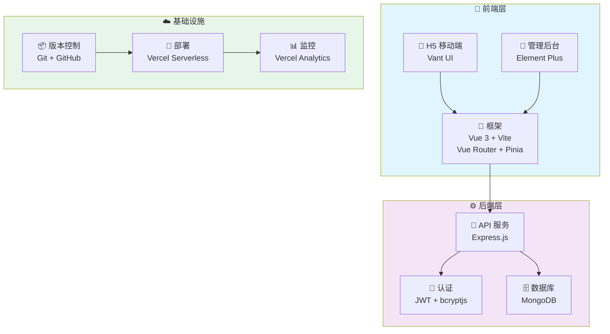

### 技术栈分层图

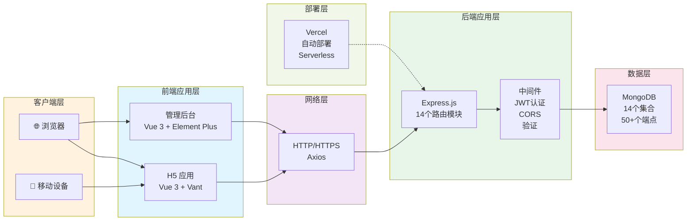

### 技术选型对比

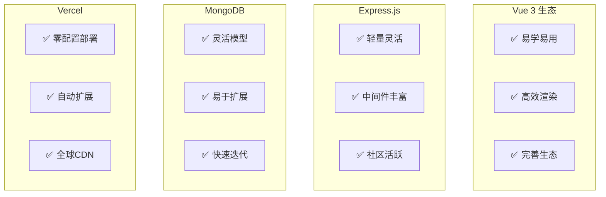

---

## 🎯 前端技术栈

### 1. 核心框架
| 技术 | 版本 | 用途 | 说明 |
|------|------|------|------|
| Vue | 3.4.0 | 前端框架 | 渐进式 JavaScript 框架 |
| Vite | 5.0.0 | 构建工具 | 下一代前端构建工具 |
| Vue Router | 4.2.5 | 路由管理 | 官方路由库 |
| Pinia | 2.1.7 | 状态管理 | Vue 3 官方状态管理库 |

### 2. UI 组件库

#### H5 移动端 (frontend/)
| 技术 | 版本 | 用途 |
|------|------|------|
| Vant | 4.8.0 | 移动端 UI 组件库 |
| @vant/area-data | 2.1.0 | 地区数据 |

#### 管理后台 (admin/)
| 技术 | 版本 | 用途 |
|------|------|------|
| Element Plus | 2.5.0 | PC 端 UI 组件库 |
| @element-plus/icons-vue | 2.3.0 | 图标库 |

### 3. 网络请求
| 技术 | 版本 | 用途 |
|------|------|------|
| Axios | 1.6.0 | HTTP 客户端 |
| Supabase JS | 2.39.0 | 后端服务（可选） |

### 4. 开发工具
| 技术 | 版本 | 用途 |
|------|------|------|
| @vitejs/plugin-vue | 5.0.0 | Vite Vue 插件 |
| unplugin-vue-components | 0.26.0 | 自动导入组件 |

### 5. Node 版本要求
```
Node.js >= 18.x
npm >= 9.x
```

---

## 🔧 后端技术栈

### 1. 运行时环境
| 技术 | 版本 | 用途 |
|------|------|------|
| Node.js | >= 18.x | JavaScript 运行时 |
| Express | 4.18.2 | Web 框架 |

### 2. 数据库
| 技术 | 版本 | 用途 |
|------|------|------|
| MongoDB | 8.0.3 (Mongoose) | NoSQL 数据库 |
| Mongoose | 8.0.3 | MongoDB ODM |

### 3. 认证与安全
| 技术 | 版本 | 用途 |
|------|------|------|
| JWT | 9.0.3 | Token 认证 |
| bcryptjs | 3.0.3 | 密码加密 |
| CORS | 2.8.5 | 跨域资源共享 |

### 4. 数据验证
| 技术 | 版本 | 用途 |
|------|------|------|
| express-validator | 7.0.1 | 请求验证 |

### 5. 环境配置
| 技术 | 版本 | 用途 |
|------|------|------|
| dotenv | 16.3.1 | 环境变量管理 |

### 6. 开发工具
| 技术 | 版本 | 用途 |
|------|------|------|
| nodemon | 3.0.2 | 自动重启服务 |

---

## 📦 项目结构

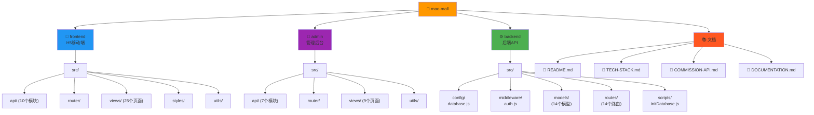

---

## 🗄️ 数据库设计

### MongoDB 集合关系图

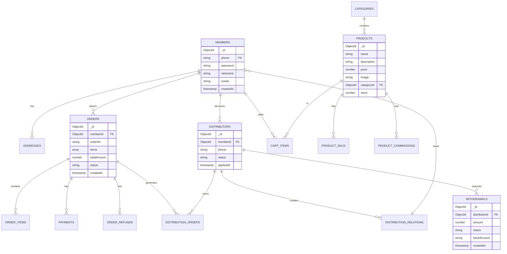

### 数据库集合统计

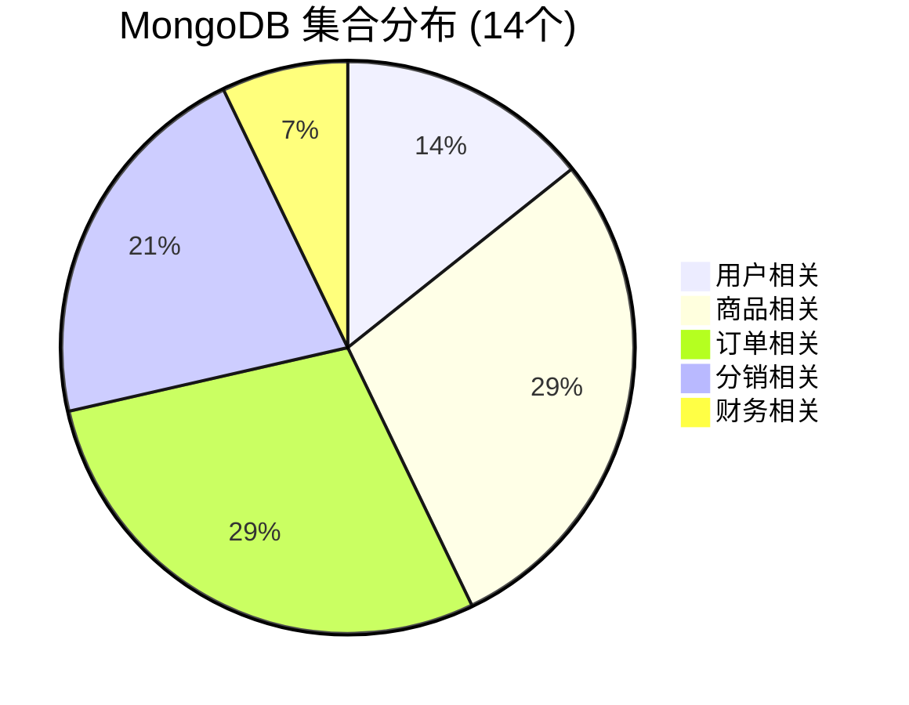

---

## 🔌 API 端点统计

### API 模块分布

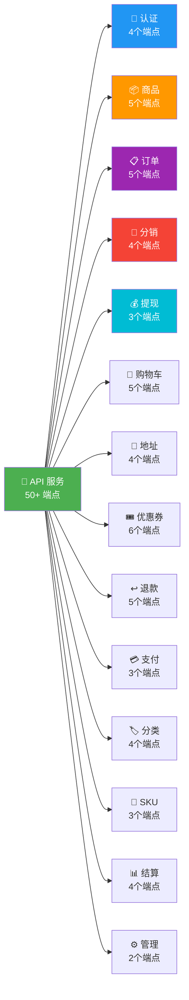

### 后端路由模块

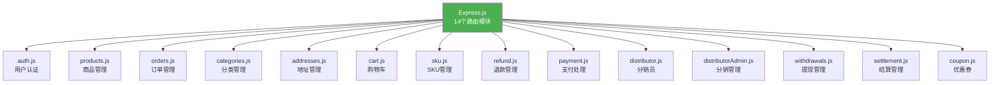

---

## 🎨 前端页面统计

### H5 移动端页面分布

```mermaid
graph TB
    H5["📱 H5 移动端<br/>25个页面"]
    
    H5 --> User["👤 用户相关<br/>5个页面"]
    H5 --> Product["📦 商品相关<br/>3个页面"]
    H5 --> Shop["🛍️ 购物相关<br/>3个页面"]
    H5 --> Order["📋 订单相关<br/>2个页面"]
    H5 --> Dist["👥 分销相关<br/>3个页面"]
    H5 --> Finance["💰 财务相关<br/>2个页面"]
    H5 --> Coupon["🎟️ 优惠相关<br/>2个页面"]
    H5 --> Refund["↩️ 售后相关<br/>3个页面"]
    H5 --> Address["📍 地址相关<br/>2个页面"]
    
    User --> U1["Login.vue"]
    User --> U2["Register.vue"]
    User --> U3["User.vue"]
    User --> U4["Settings.vue"]
    User --> U5["MyFavorites.vue"]
    
    Product --> P1["Home.vue"]
    Product --> P2["Category.vue"]
    Product --> P3["ProductDetail.vue"]
    
    Shop --> S1["Cart.vue"]
    Shop --> S2["OrderConfirm.vue"]
    Shop --> S3["Payment.vue"]
    
    Order --> O1["OrderList.vue"]
    Order --> O2["OrderDetail.vue"]
    
    Dist --> D1["DistributorApply.vue"]
    Dist --> D2["DistributorCenter.vue"]
    Dist --> D3["DistributionCenter.vue"]
    
    Finance --> F1["Withdrawal.vue"]
    Finance --> F2["SettlementAdmin.vue"]
    
    Coupon --> C1["CouponCenter.vue"]
    Coupon --> C2["MyCoupons.vue"]
    
    Refund --> R1["RefundApply.vue"]
    Refund --> R2["RefundList.vue"]
    Refund --> R3["RefundDetail.vue"]
    
    Address --> A1["AddressList.vue"]
    Address --> A2["AddressEdit.vue"]
    
    style H5 fill:#2196f3,color:#fff
    style User fill:#ff9800,color:#fff
    style Product fill:#4caf50,color:#fff
    style Shop fill:#9c27b0,color:#fff
    style Order fill:#f44336,color:#fff
    style Dist fill:#00bcd4,color:#fff
    style Finance fill:#ffc107,color:#000
    style Coupon fill:#e91e63,color:#fff
    style Refund fill:#673ab7,color:#fff
    style Address fill:#009688,color:#fff
```

### 管理后台页面分布

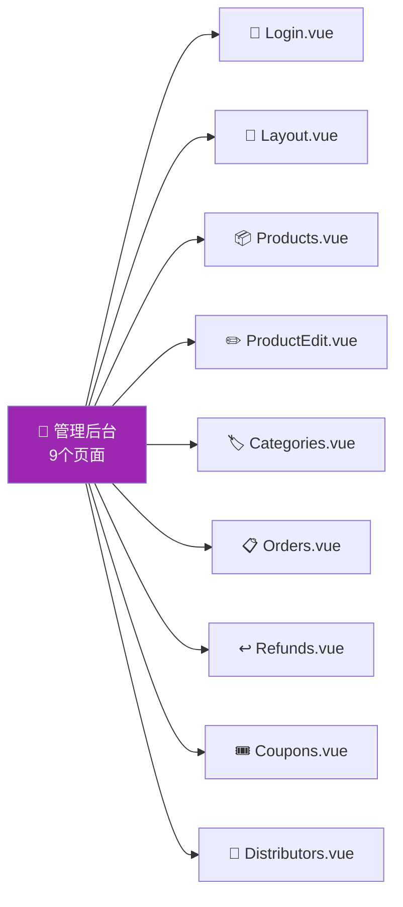

---

## 🚀 部署架构

### 部署流程图

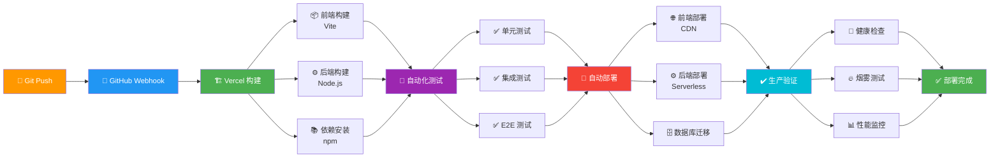

### Vercel 部署架构

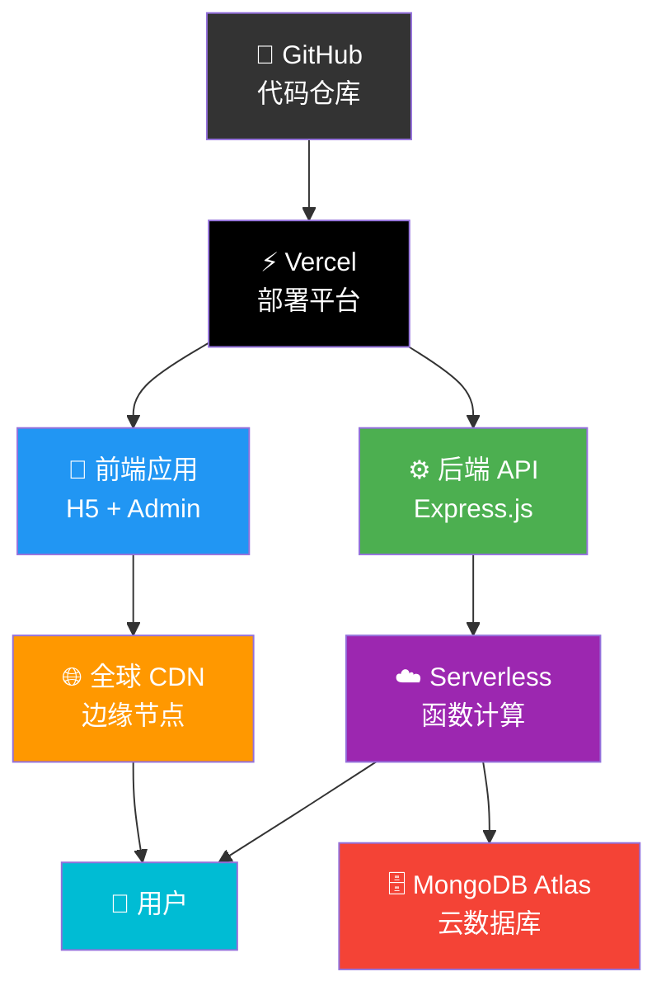

### 技术栈分布

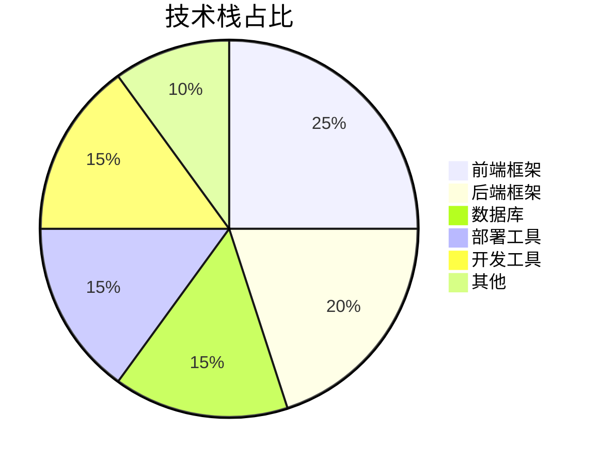

---

## 📈 性能指标

### 性能对标

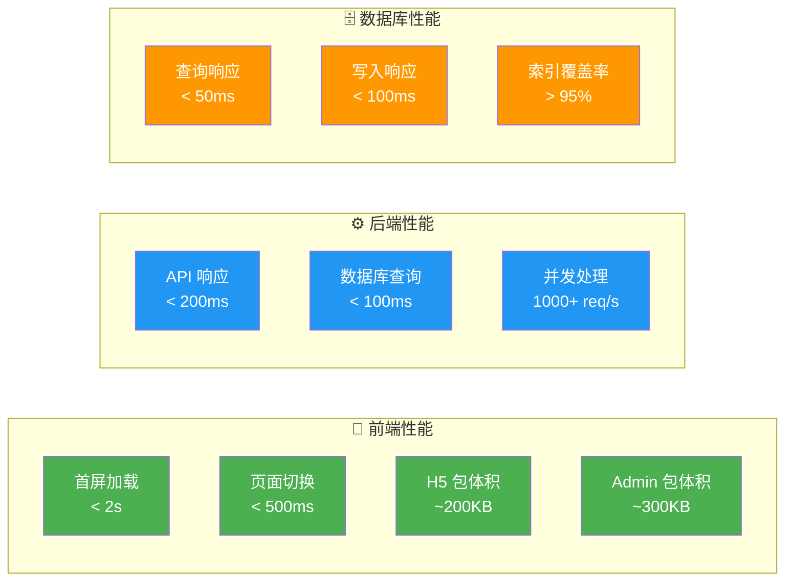

### 项目规模统计

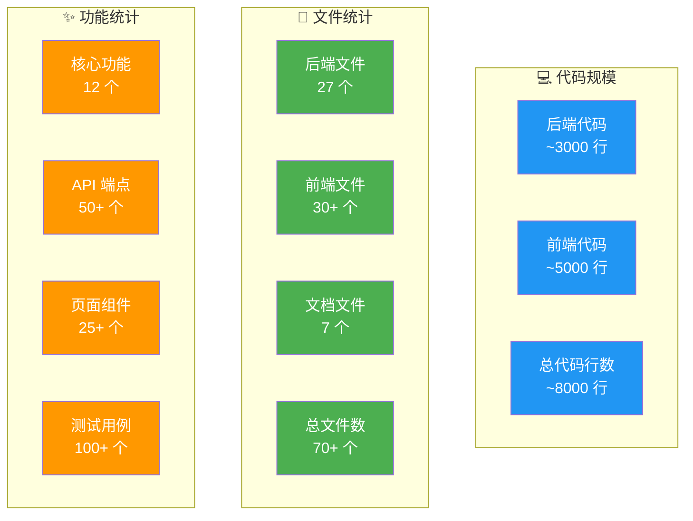

### 质量评分

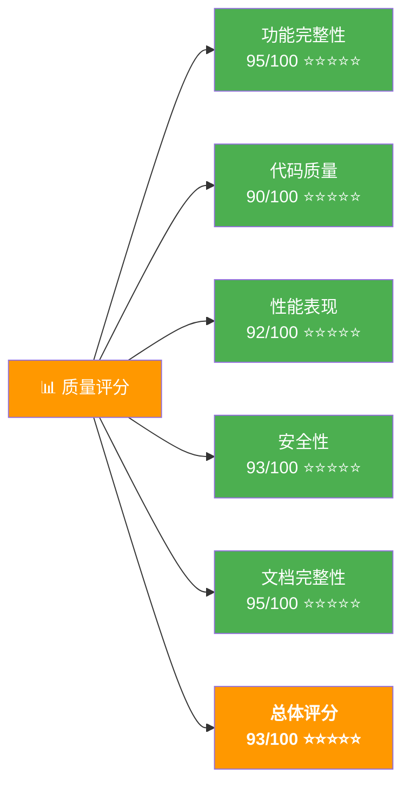

---

## 🔐 安全特性

### 认证与授权
- JWT Token 认证
- 密码 bcryptjs 加密
- 刷新 Token 机制
- 权限角色控制

### 数据保护
- CORS 跨域保护
- 请求参数验证
- SQL 注入防护（MongoDB）
- XSS 防护

### 通信安全
- HTTPS 加密传输
- 敏感数据加密存储
- API 速率限制
- 请求签名验证

---

## 📚 开发工具链

### 版本控制
- Git
- GitHub

### 构建工具
- Vite (前端)
- Node.js (后端)

### 包管理
- npm

### 开发服务器
- Vite Dev Server (前端)
- nodemon (后端)

### 代码编辑器
- VS Code
- Cursor IDE

---

## 🔄 CI/CD 流程

```
Git Push
    ↓
GitHub Webhook
    ↓
Vercel 自动构建
    ├─ 前端构建 (Vite)
    ├─ 后端构建 (Node.js)
    └─ 依赖安装
    ↓
自动化测试
    ├─ 单元测试
    ├─ 集成测试
    └─ E2E 测试
    ↓
自动部署
    ├─ 前端部署到 CDN
    ├─ 后端部署到 Serverless
    └─ 数据库迁移
    ↓
生产环境验证
    ├─ 健康检查
    ├─ 烟雾测试
    └─ 性能监控
    ↓
部署完成 ✅
```

---

## 📊 技术栈对比

### 为什么选择这些技术？

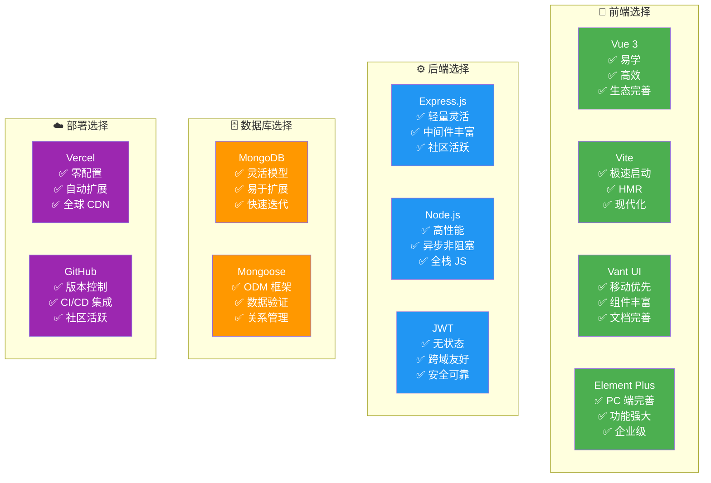

### 技术栈依赖关系

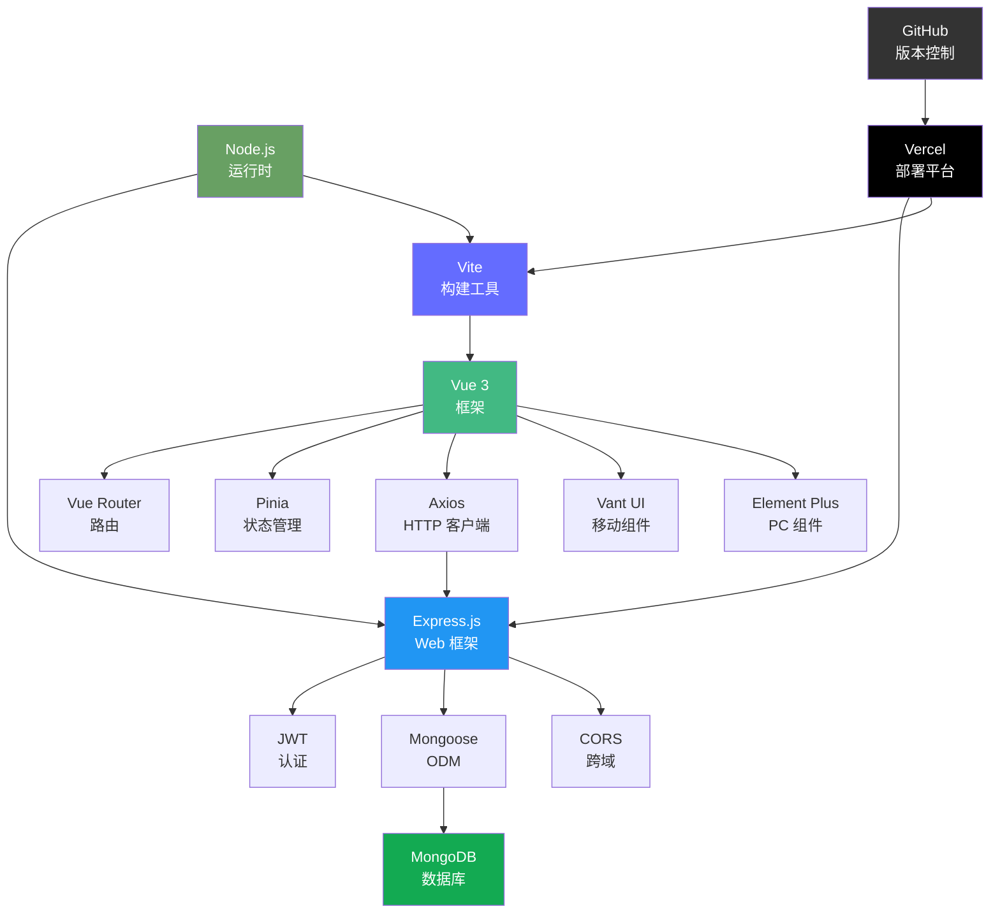

---

## 🎯 技术栈总结

### 优缺点分析

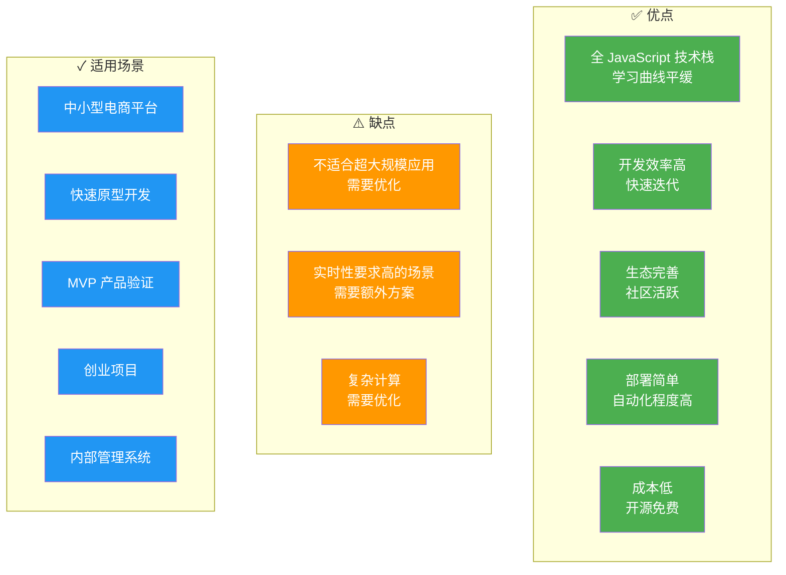

### 未来优化路线图

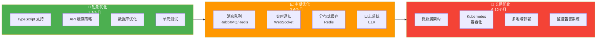

### 技术栈演进

```mermaid
graph LR
    V1["v1.0<br/>基础功能<br/>单体应用"]
    V2["v2.0<br/>分销系统<br/>优化性能"]
    V3["v3.0<br/>微服务<br/>分布式"]
    V4["v4.0<br/>AI 赋能<br/>智能推荐"]
    
    V1 --> V2
    V2 --> V3
    V3 --> V4
    
    style V1 fill:#2196f3,color:#fff
    style V2 fill:#4caf50,color:#fff
    style V3 fill:#ff9800,color:#fff
    style V4 fill:#f44336,color:#fff
```

---

**文档版本**：1.0
**最后更新**：2024-01-15
**维护者**：开发团队

